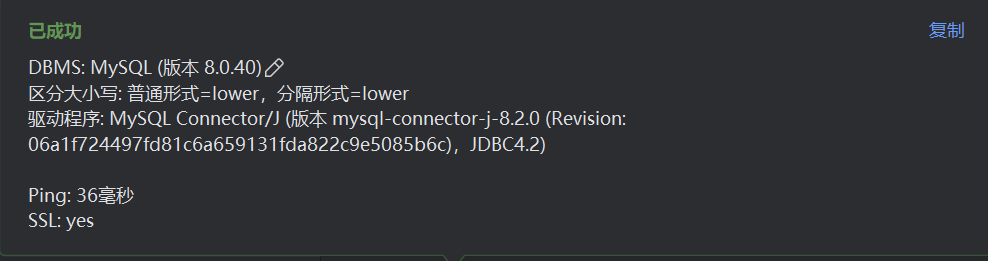
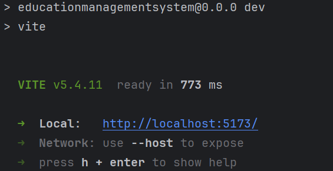
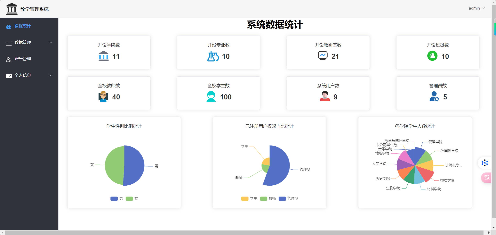

# 教学管理系统（课设）使用文档
该系统使用技术栈为vue3+SpringBoot，若需要可自取
注：在安装前确保设备上已安装[node.js](https://nodejs.org/en/download "node.js官网链接")、[mysql](https://dev.mysql.com/downloads/mysql/ "mysql官网链接")

启动流程：

1. 在根目录下打开命令行执行以下指令安装依赖

```sh
cd EducationManagementSystem
pnpm install
```

2. 确保数据库成功连接

   
3. 在当前目录找到sql目录下的create.sql及insert.sql文件并先后执行进行建库及测试数据插入
4. 回到根目录，找到该路径src/main/resources下的application.properties文件，修改mysql连接的账号密码（默认账号为root，密码为1234）

   ```Java
   spring.datasource.username=root
   spring.datasource.password=1234
   ```
5. 在根目录下打开命令行执行以下指令启动前端，在idea编译器中启动Spring Boot后端

   ```sh
   cd EducationManagementSystem
   npm run dev
   ```

    

6. 打开链接查看并测试结果（管理员账户密码都为admin，教师注册码teacher，管理员注册码admin）

   

   
